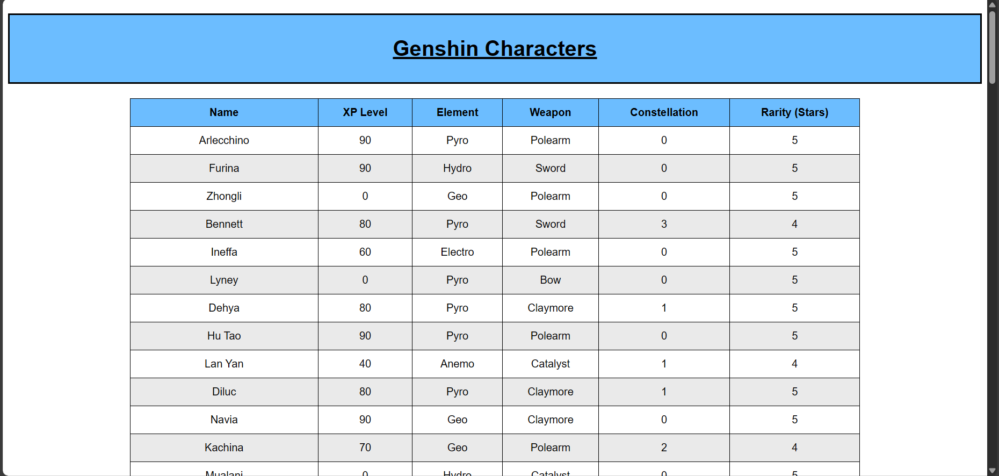

# TypeScript PostgreSQL App

A TSX React app I wrote to interact with my Genshin database. This project is not
meant to be run on any other computer. This is uploaded as a skills reference
only.

- Author: Ethan Kletschke
- Version: `1.0.0`
- Environment(s): Ubuntu (WSL)
- License: MIT

## Screenshot of Output

Here's a screenshot of the output to show that the app works on my machine:

